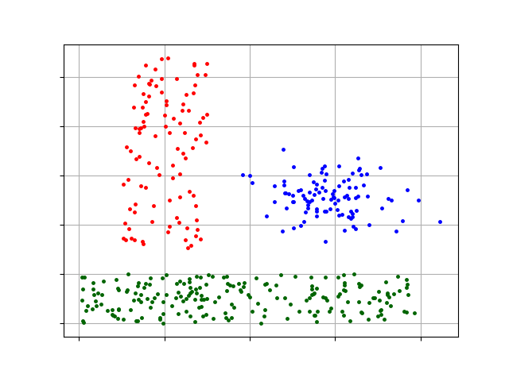
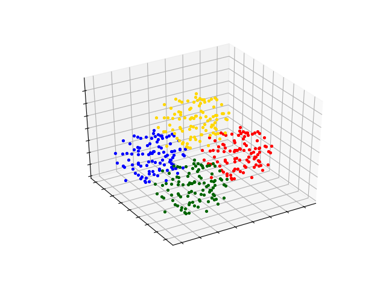

## CURE clustering algorithm
&emsp;&emsp;The CURE algorithm is a hierarchical clustering algorithm, and most clustering algorithms are good at processing spherical and similar-sized clusters, or become more vulnerable when there are isolated points. CURE uses a novel hierarchical clustering algorithm. The algorithm chooses an intermediate strategy between centroid-based and representative-object-based methods.\
&emsp;&emsp;Rather than a single centroid or object representing a class, it selects a fixed number of representative points in the data space. The representative points of a class are generated by first selecting the scattered objects in the class, and then "shrinking" or moving them according to a specific score or shrink factor.\
&emsp;&emsp;At each step of the algorithm, two classes that have the closest pair of representative points (each point from a different class) are merged. Having more than one representative point for each class allows CURE to adapt to non-spherical geometries. Class shrinkage or cohesion can help control the effects of outliers. Therefore, CURE's processing of outliers is more robust, and it can identify non-spherical and large-sized classes. For large databases, CURE uses a combination of random sampling and partitioning: a random sample is divided first, and each partition is partially clustered.\
&emsp;&emsp; Therefore, this work uses Python3 to implement the CURE clustering algorithm, and there are detailed comments in the code for learning to use.
### Environment Settings
+ Python3、pandas、numpy、pyclustering

### Example to run the codes.
The instruction of commands has been clearly stated in the codes (see the parse_args function).

+ python manually_cure.py dataset_filename k

### Dataset
We provide all two fcps datasets which is from pyclustering moduel:

**SAMPLE_LSUN.csv**
+ Each Line is a instance: feature1,feature2

**SAMPLE_TETRA.csv**
+ Each Line is a instance: feature1,feature2,feature2

### Result
We use SAMPLE_LSUN dataset and set k to be 3,the result are as follow:

 

We use SAMPLE_TETRA dataset and set k to be 4,the result are as follow:

### Shortcoming
Due to the short time, there are disadvantages such as code redundancy and long running time, so I have time to optimize the code.